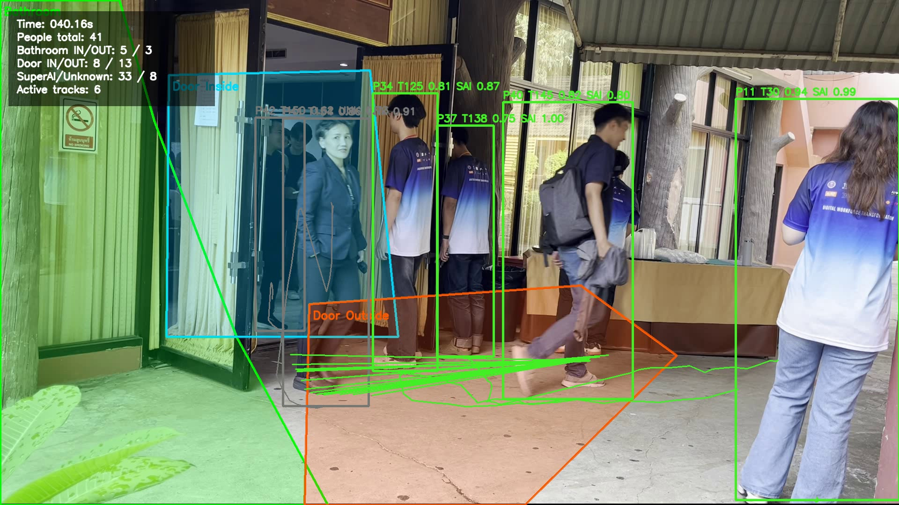

# People Counting and Shirt Classification

Computer vision pipeline for an entrance-camera video. The project detects people, tracks each person across frames, counts movement events through configured zones, classifies whether each tracked person is wearing a SuperAI shirt, and exports an annotated result video.



## Quick Start

1. Put the input video at the project root:

```text
entrance.mov
```

2. Install dependencies. For Windows + NVIDIA GPU:

```bat
git clone https://github.com/Combine1234/CODING_TEST-People-Counting-Connected_Tech-.git
cd /d CODING_TEST-People-Counting-Connected_Tech-
py -3.11 -m venv .venv_gpu
.venv_gpu\Scripts\python.exe -m pip install --upgrade pip
.venv_gpu\Scripts\python.exe -m pip install torch torchvision --index-url https://download.pytorch.org/whl/cu124
.venv_gpu\Scripts\python.exe -m pip install -r requirements.txt
```

3. Run the main pipeline:

```bat
run_main.bat
```

Or run it manually:

```bat
.venv_gpu\Scripts\python.exe scripts\count_people_video.py --video entrance.mov --model yolov8s.pt --shirt-classifier models\shirt_classifier_best.pt --zones configs\counting_zones.json --output-dir Dataset\counting_output --output-video entrance_counted_with_shirts.mp4 --process-every 3 --imgsz 512 --device 0
```

Outputs:

```text
Dataset\counting_output\entrance_counted_with_shirts.mp4
Dataset\counting_output\count_summary.json
Dataset\counting_output\count_events.csv
Dataset\counting_output\shirt_person_summary.csv
```

## Latest Local Result

These metrics were produced on the provided `entrance.mov` during local validation:

```text
unique_people: 103
bathroom_in:   9
bathroom_out:  12
door_in:       13
door_out:      20
SuperAI shirt: 86
Unknow shirt:  15
unknown shirt: 2
```

On the video overlay:

```text
SAI = Superai_Shirt
UNK = Unknow_Shirt
?   = not enough confidence yet
```

## Pipeline

1. Export frames from the video every 1 second to create an initial dataset.
2. Auto-label person boxes with YOLO and save editable LabelMe JSON files.
3. Convert corrected LabelMe labels back to YOLO format for future detector training.
4. Track people across the full video with BoT-SORT and lightweight ReID merging.
5. Count bathroom and door in/out events using configurable polygon zones.
6. Crop the torso area of each tracked person and classify the shirt with the trained classifier.
7. Export an annotated video, summary JSON, event CSV, and per-person shirt CSV.

## Repository Structure

```text
.
|-- assets/                         # Preview image for README
|-- configs/counting_zones.json     # Editable counting-zone polygons
|-- models/
|   |-- shirt_classifier_best.pt     # Trained shirt classifier
|   `-- shirt_classifier_best.metadata.json
|-- run_scripts/                    # Convenience Windows scripts
|-- scripts/
|   |-- capture_entrance_frames.py
|   |-- auto_label_people_for_labelme.py
|   |-- crop_person_bodies.py
|   |-- train_shirt_classifier.py
|   `-- count_people_video.py
`-- README.md
```

Large local artifacts are intentionally not committed:

```text
entrance.mov
Dataset/
runs/
.venv_gpu/
output videos
raw image crops
```

## Train the Shirt Classifier Again

Prepare class folders:

```text
Dataset\shirt_crop_dataset\Superai_Shirt
Dataset\shirt_crop_dataset\Unknow_Shirt
```

Then run:

```bat
run_scripts\run_train_shirt_classifier.bat
```

The updated model will be copied to:

```text
models\shirt_classifier_best.pt
```

## Notes

- This repository uses shirt **classification**, not segmentation. The current shirt dataset is organized as class folders, so it is suitable for YOLO classification. YOLO segmentation would require mask or polygon labels for the shirt area.
- The person detector defaults to `yolov8s.pt`; Ultralytics downloads it automatically if it is not already cached.
- Counting accuracy depends on the detector, tracker stability, occlusion, and the zone polygons in `configs/counting_zones.json`.
